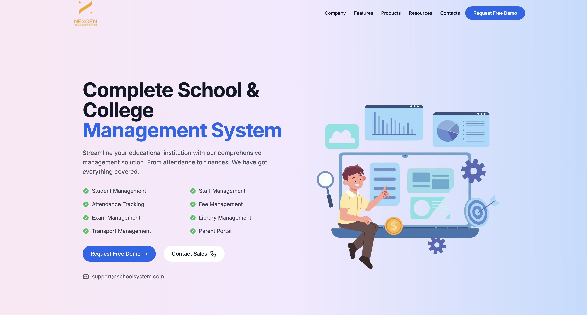

# NexVidya Portfolio

A modern, responsive portfolio website built with Next.js 13, TypeScript, and Tailwind CSS.

## Screenshots



## 🛠️ Tech Stack

- [Next.js 13](https://nextjs.org/) - React Framework
- [TypeScript](https://www.typescriptlang.org/) - Programming Language
- [Tailwind CSS](https://tailwindcss.com/) - CSS Framework
- [React](https://reactjs.org/) - JavaScript Library

## 🏗️ Project Structure

```
nexvidya-portfolio/
├── public/              # Static files
├── src/
│   ├── app/            # App router pages
│   ├── components/     # React components
│   ├── types/         # TypeScript types
│   └── utils/         # Utility functions
├── tailwind.config.js  # Tailwind configuration
└── package.json       # Project dependencies
```

## 🚀 Getting Started

1. **Clone the repository**

```bash
git clone https://github.com/NexGenInnovs/nexvidya-portfolio.git
cd nexvidya-portfolio
```

2. **Install dependencies**

```bash
npm install
# or
yarn install
```

3. **Run the development server**

```bash
npm run dev
# or
yarn dev
```

Open [http://localhost:3000](http://localhost:3000) to view the website.

## 📝 Environment Variables

Create a `.env.local` file in the root directory and add the following variables:

```env
NEXT_PUBLIC_SITE_URL=your-site-url
```

## 🎨 Customization

### Content

Update the content in the respective components under `src/components/`.

## 📦 Build

```bash
npm run build
# or
yarn build
```


## 🤝 Contributing

1. Fork the repository
2. Create your feature branch (`git checkout -b feature/amazing-feature`)
3. Commit your changes (`git commit -m 'Add some amazing feature'`)
4. Push to the branch (`git push origin feature/amazing-feature`)
5. Open a Pull Request


## 👥 Authors

- **NexGen Innovations** - [GitHub](https://github.com/NexGenInnovs)